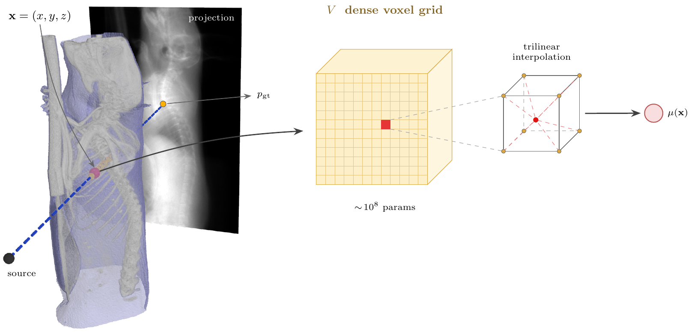

# eXplore CT 120 Reconstruction

[](LICENSE)
[](https://www.python.org/)

Cone-beam CT reconstruction for the GE eXplore CT 120 micro-CT scanner.
Point it at a scan folder and get a calibrated HU volume back.



*Each detector pixel measures a line integral of the attenuation μ along a
ray from the source. Reconstruction recovers the volume, here a dense voxel
grid, from those measurements.*

| Family | Algorithms | Needs |
|---|---|---|
| Analytic (`fdk/`) | FDK with ramp / Shepp-Logan / cosine / Hamming windows, Parker weighting | PyTorch |
| Classical iterative (`iterative/`) | ASTRA: SIRT, CGLS, SART. TIGRE: OS-SART, SART, SIRT, MLEM, +TV | CUDA + `astra-toolbox` or `pytigre` |
| Learning-based (`learning_based_iterative/`) | Differentiable projector + gradient descent; voxel grid by default, other representations pluggable | CUDA |

All three share the same loading, preprocessing, geometry calibration, HU
calibration and output format, so their volumes are directly comparable.

## Install

```bash
git clone https://github.com/UBC-Ford-lab/eXplore_CT_120_reconstruction_algorithms.git reconstruction
cd reconstruction && pip install -e .
pip install astra-toolbox pytigre wandb   # optional backends + logging
```

The drivers are run as modules from the directory that contains the clone,
so keep the folder named `reconstruction`.

## Usage

```bash
cd ..   # the directory containing reconstruction/

python -m reconstruction.run_fdk_recon data/scans/Scan_1988
python -m reconstruction.run_iterative_recon data/scans/Scan_1988 --backend astra --algorithm SIRT3D_CUDA --iterations 100
python -m reconstruction.run_iterative_recon data/scans/Scan_1988 --backend tigre --algorithm ossart --tv-lambda 10
python -m reconstruction.run_learned_recon data/scans/Scan_1988 --downsample 3
```

A scan folder holds the projection `.vff` files, `scan.xml`, and the
`bright.vff` / `dark.vff` flat-field frames. Each run writes a `.vff`
volume next to the scan folder, a `.json` sidecar with the grid and the
fitted HU map, and a `_plots/` folder with slices, histogram and projection
diagnostics. `--help` lists every flag.

## Pipeline

```
raw projections → flat-field + log → air normalization + ring correction
  → detector rotation calibration (measured once per scan, cached)
  → FDK | ASTRA / TIGRE | learned
  → μ (mm⁻¹) → HU calibration → .vff + .json + plots
```

Defaults that matter, each with a `--no-...` or explicit override:

- **Field of view and ROI are `auto`**: the grid is what the detector
  subtends, tightened to the object; the export region is the scanner's own
  `SubVolumeCoordinates.xml` box, so results line up with the vendor volume.
- **Model domain `auto`** (iterative and learned): backends that fit the
  projections cover everything a ray crosses, bed included, otherwise the
  missing attenuation becomes a smooth HU bias. `--roi` then only crops the
  output.
- **HU calibration** fits two anchors from the volume's own histogram: air
  at −1000 HU and bulk soft tissue at `--tissue-hu` (default +120, use 0 for
  a water phantom). No phantom or scanner constant needed.
- **Preflight** estimates VRAM and RAM before allocating anything.
  `--preflight-only` just prints the report.
- **Weights & Biases** logging is on when `--wandb-project` or
  `$WANDB_PROJECT` names a project; nothing is hardcoded and nothing is
  uploaded otherwise.

## Learning-based reconstruction

Fits a volume model to the line integrals through a differentiable ray
tracer, with Adam, non-negativity, LR warmup and plateau reduction, and a
held-out projection for early stopping. Main flags: `--loss` (`mse`,
`huber`, `ssim`, `msssim`, `sart`, ...), `--iterations`, `--rays-per-batch`
(sized from free VRAM by default), `--emulate-sart`, `--compile`.

A new representation only has to answer three hooks in a
`LearnedReconstructor` subclass: `build_model`, `build_domain`,
`export_volume`. Register it with a `LearnedAlgorithm` descriptor and it
becomes an `--algorithm` choice; `voxel/` is the 100-line example. A
representation in another package works the same way via
`--algorithm-module my_package.algorithms`.

## Other tools

```bash
python -m reconstruction.run_volume_report VOLUME.vff            # slices, histogram, HU anchors of any finished volume
python -m reconstruction.run_projection_report SCAN --volume a.vff --volume b.vff   # score volumes against the measured projections
python -m reconstruction.run_geometry_calibration SCAN           # pre-measure the detector rotation on a GPU node
```

Use `--vendor` with the report tools for a GE volume; it applies the
vendor's axis conventions and locates the ROI from the scan.

## Layout

```
run_*.py                    drivers, one per family plus the report tools
ct_core/                    shared: scan loading, preprocessing, geometry
                            calibration, HU calibration, preflight, VFF I/O
fdk/                        filtered backprojection
iterative/{astra,tigre}/    toolbox wrappers
learning_based_iterative/   trainer, ray sampler, renderer, losses, voxel/
```

## License

MIT, see [LICENSE](LICENSE).
